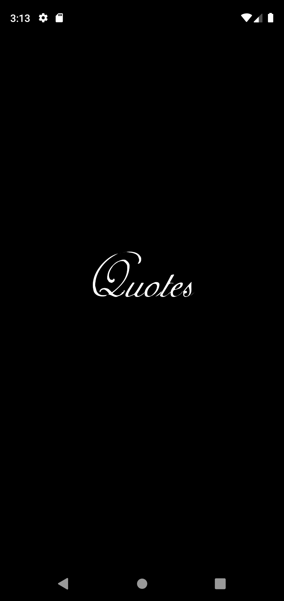
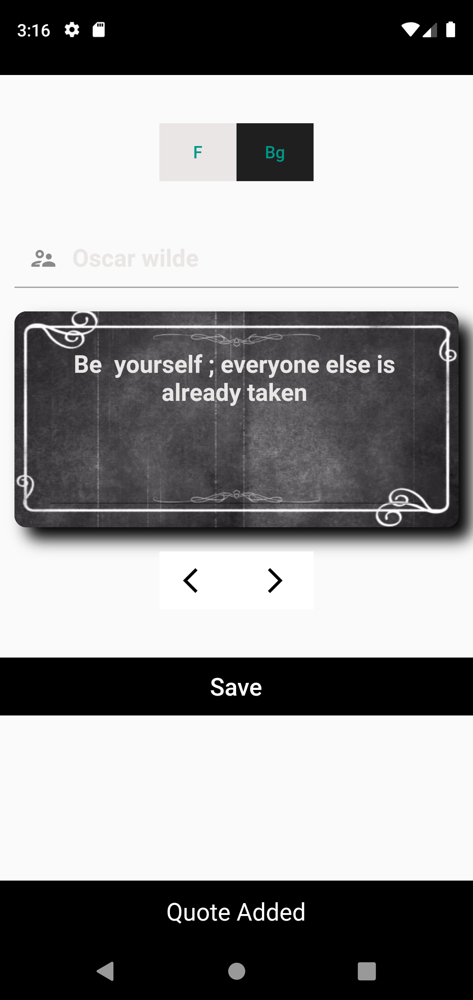
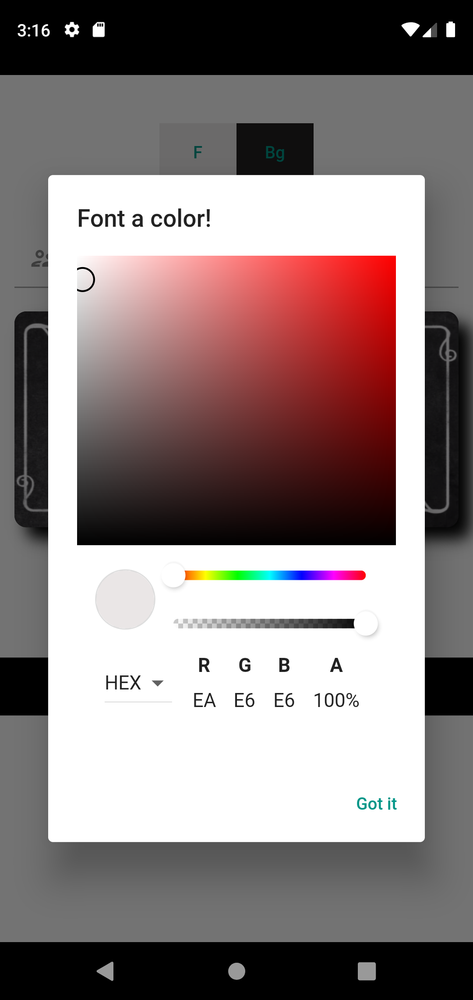
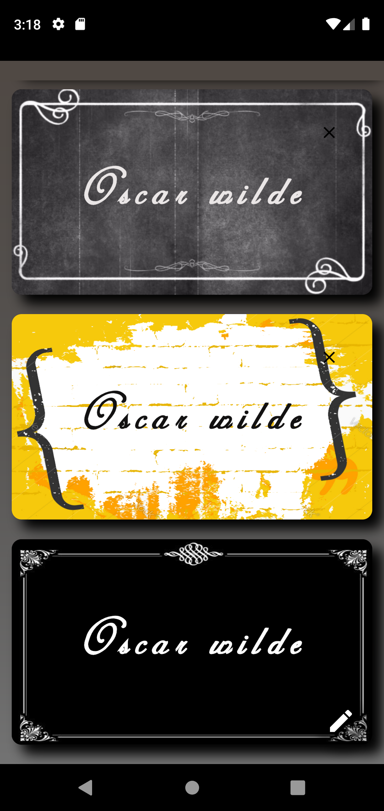
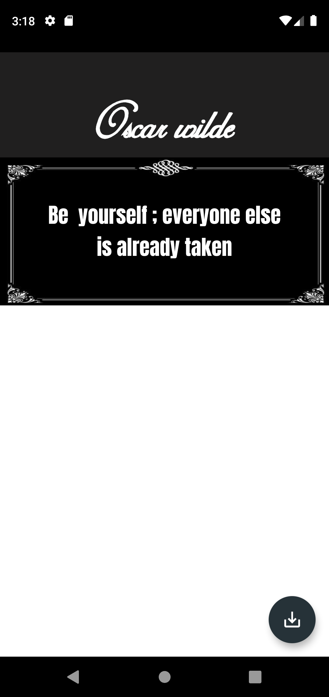
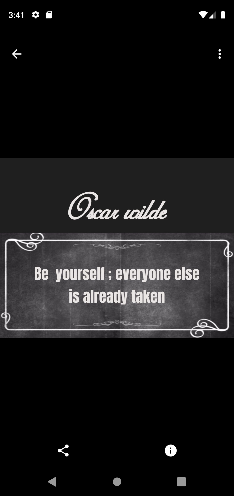
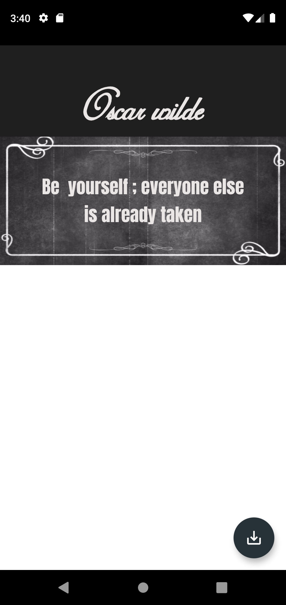
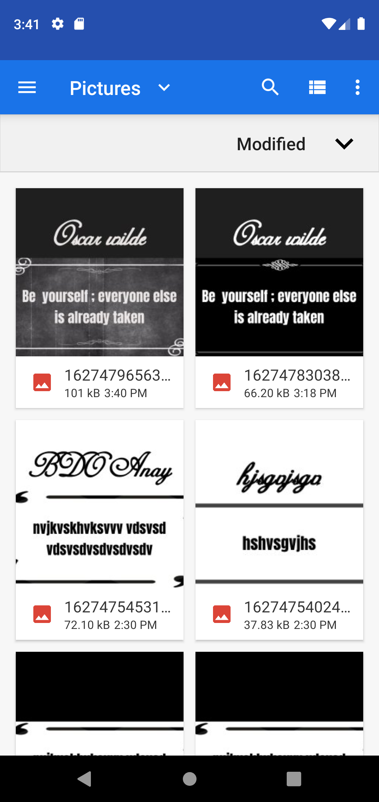

# Quote

This is Flutter project help you to make Beautiful Quote and share with your friends.

## Getting Started

This project is a starting point for a Flutter application.
This project Contain SplashScreen and homePage view list of Beautiful Quote you will create and you can 
 click to floatingActionButton to go to add_quote_screen and you can put you quote ,Author and 
 select border using arrow you have (more than 10 border)  and font or background color if you end you can save it
 you can go bCK TO HomeScreen and you will find it click her and you can see it and download it in you dives to Share
  With your Friends .

### Screenshots

 
     
      
